# 大学生Steam使用指南
**作者：OTAXIO**

---

## 摘要
进入大学以后，大多数大学生都会开始接触到电脑游戏。在众多的游戏游玩方式中，Steam无疑是大众的选择。然而，对于很多刚接触电脑游戏的大学生来说，如何使用Steam却成为了一个难题。事实上，在互联网上有着大把的Steam游玩教学视频，但是大多都比较分散，没有一个整体的Steam使用介绍。因此，笔者突发奇想，决定制作一个文档来帮助各位更加顺利的使用Steam这个游戏平台。由于笔者资历颇浅，有任何不正确的地方还请多多指出交流。欢迎大家通过末尾的邮箱联系我，提出建议完善这篇文章。

---

## 什么是Steam？
简单来说，Steam就是一个游戏平台。在这个平台上，你可以购买游戏，并通过Steam启动游戏进行游玩。打个不确切的比方，Steam就像一个网吧，所有Steam用户都在网吧里玩游戏。每个人的账户就是一台网吧电脑。你在Steam购买游戏并下载完成以后，老板就给你一个装着游戏的硬盘，然后你就能在网吧电脑游玩你购买的游戏。但是，这个硬盘只能在你自己的网吧电脑上玩。如果你用其他网吧（比如Epic），那么即使这个硬盘就缺少许可无法打开。所以闲来没事不要注销自己的账户。

相较于其他的游戏平台，Steam有着更好的社区环境，更多的游玩人数，并且几乎一直在打折（有春促夏促秋促冬促，还有各种游戏节日），对于刚接触电脑游戏的玩家来说十分友好。并且，除了绝大多数游戏公司会在Steam上发售游戏，例如育碧，卡普空等等，还有很多个人游戏开发者会把自己的游戏在Steam上发布，平台上的游戏种类非常之全面。

---

## 如何安装Steam

### 正版Steam安装

#### 官方下载
如果担心自己无法分辨Steam真假，那么请不要在互联网上搜索（尤其像百度这类广告很多的搜索引擎），直接输入下面的官方网站网址：

[Steam官方网站](https://store.steampowered.com/)

由于Steam的服务器在国外，国内有时候网站会出现无法打开的情况。对于这种情况，建议大家使用加速器进行Steam加速（没有必要使用魔法）。绝大多数加速器加速Steam页面都是免费的，笔者这里使用的是网易UU加速器（并非广告），直接在官网下载即可。

打开网站可以看到右上角有个绿色的安装图标，点击进入，按照流程进行下载和注册账号即可。

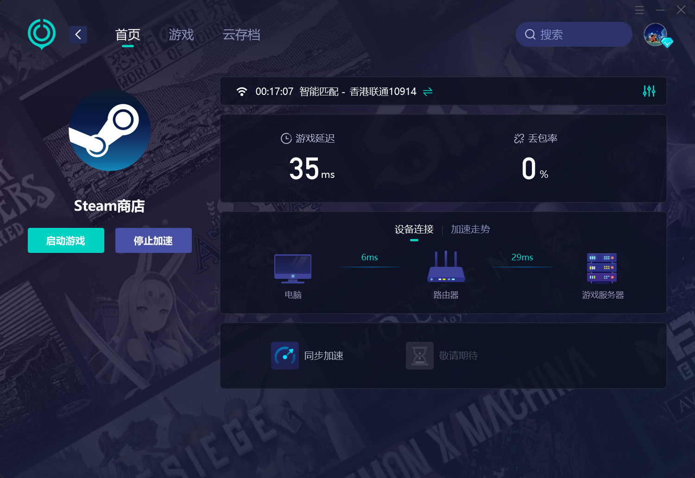
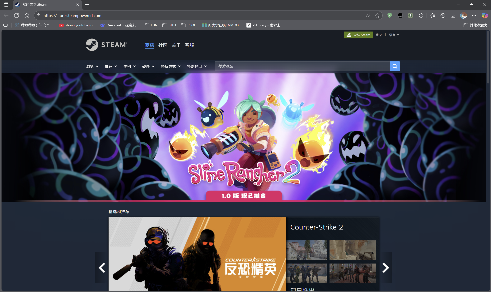
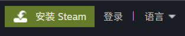

#### 关于蒸汽平台
蒸汽平台是国内本土化的Steam，但由于笔者还未体验过，因此不做评价。但就笔者所知，蒸汽平台玩家数量远远不如Steam。推荐大家都去使用Steam而不是蒸汽平台，避免多余麻烦。

### 常见盗版网站和盗版损害
有的人会说，我下盗版Steam的管你什么事，我还不是照样能玩游戏。的确，盗版Steam短时间可能没有什么问题。但是时间久了以后你就会发现，你的盗版Steam会弹出会员充值项目，商城里的游戏会以更贵的价格卖给你，并且你并不是你账号的唯一拥有者，而是很多人共同使用这一个账号，所以有时候其他人在玩游戏会导致你玩不了，或者玩一半你被踢出去了。相比之下，Steam本身是免费的，游玩体验也远胜盗版，没有必要去折磨自己。

---

## Steam的常见功能

### 主页
当你登录上你的账户并且打开后看到的就是你的Steam主页：

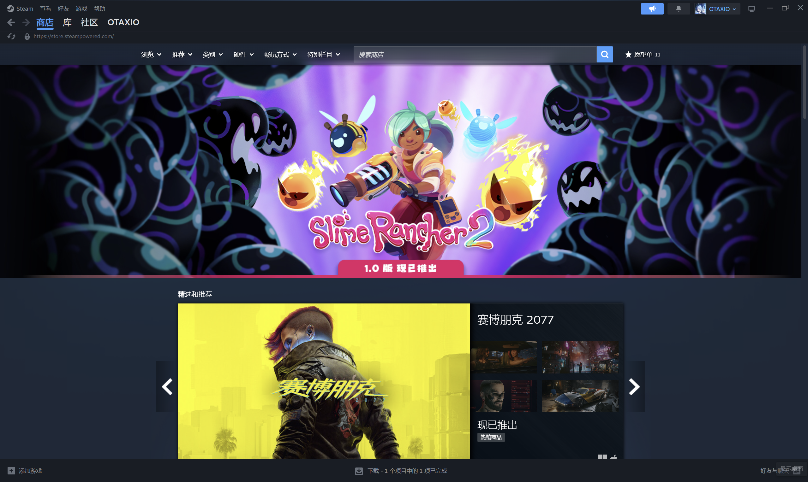

往下翻可以看到游戏分类、推荐等等。你可以一直往下翻。

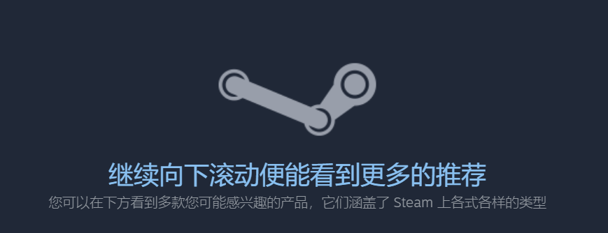

笔者在主页使用最多的功能就是找到新品或折扣：

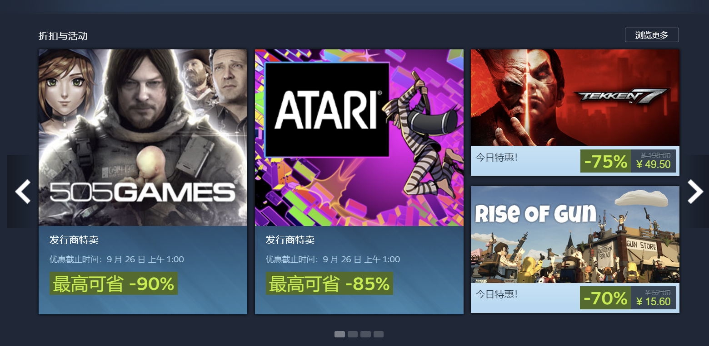

---

### 四大功能
左上角有四个大字号的功能：

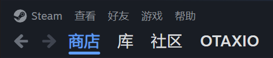

它们分别是 **商店、库、社区、个人（用户名称）**。

#### 商店
- **精选**：其实就是主页，包含最近打折、新出的、热门的游戏。
- **探索队列**：根据你平时游玩的游戏类型进行推荐。
- **愿望单**：类似购物平台收藏，好友能看到；游戏打折时会邮件提醒。
- **点数商店**：卖头像、背景、动画等装饰品。买游戏可获得点数。
- **新闻**：游戏资讯、更新信息。
- **统计数据**：展示最近的畅销游戏和在线人数最多的游戏。

 | 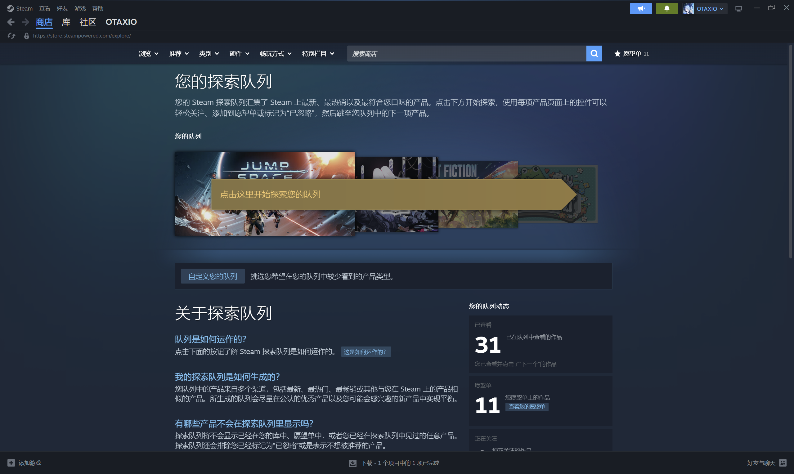  
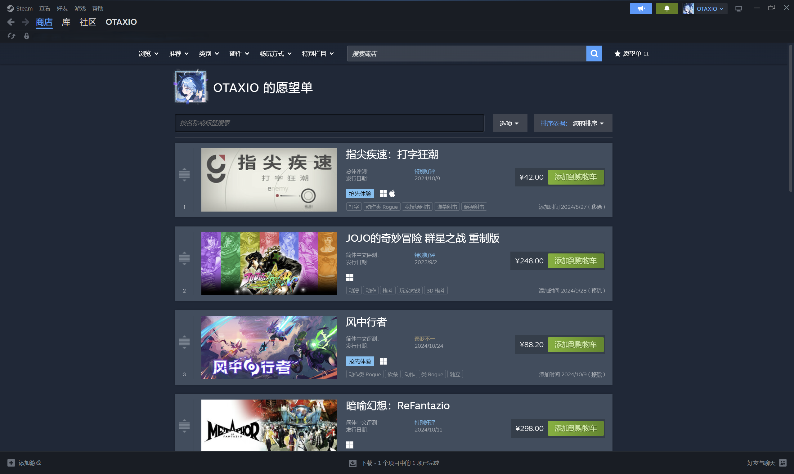 | 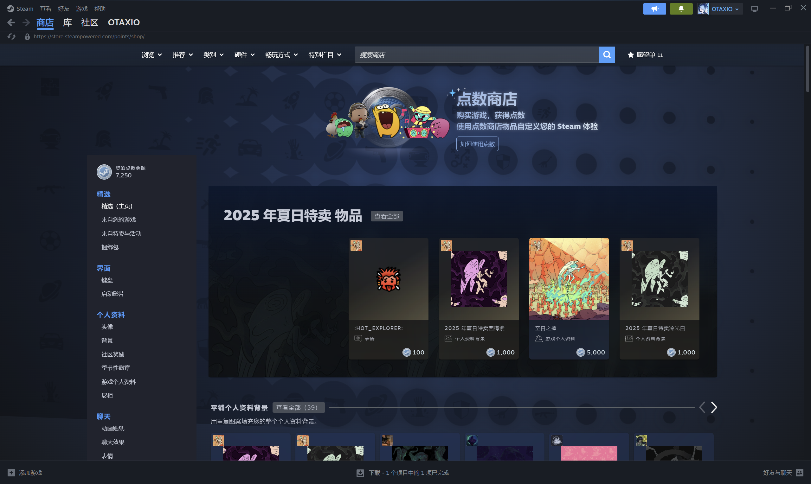  
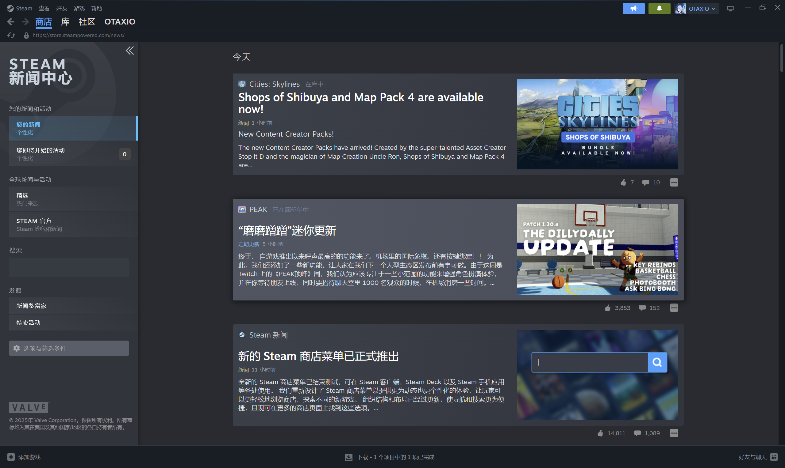 | 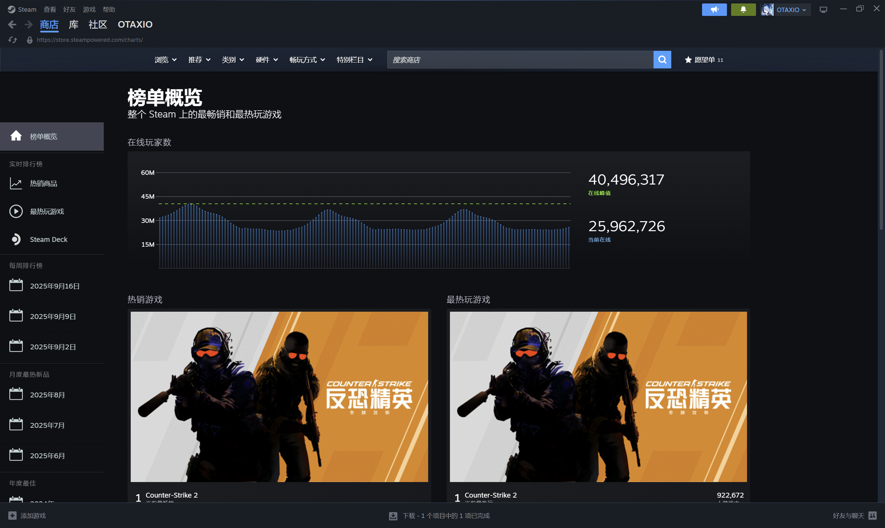  

#### 库
- **主页**：展示你已购买的游戏。
- **收藏**：分类功能，可以像文件夹一样管理游戏。
- **下载**：查看游戏下载进度。

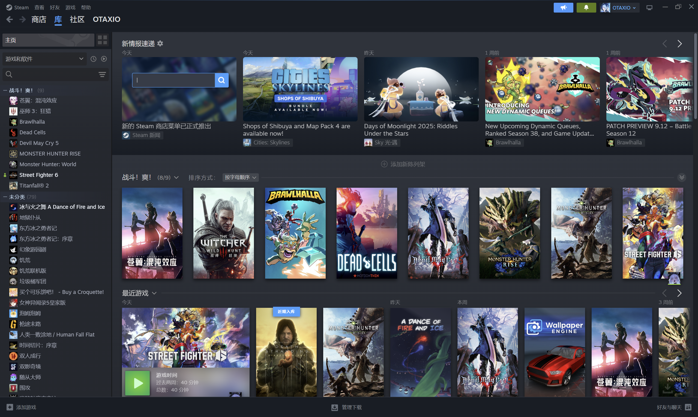 | 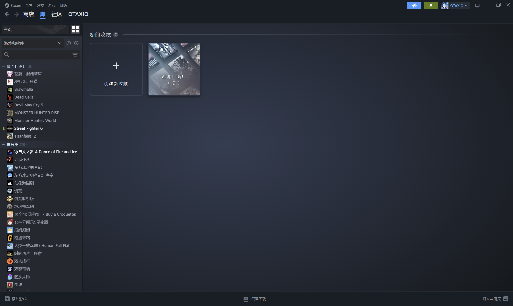  

#### 社区
主要用于下载 mod 和进行游戏道具交易。

#### 个人
查看个人资料以及好友、库存、成就等。  
特别注意：**添加好友**需要在Steam上消费至少5美元（CDK激活不算）。

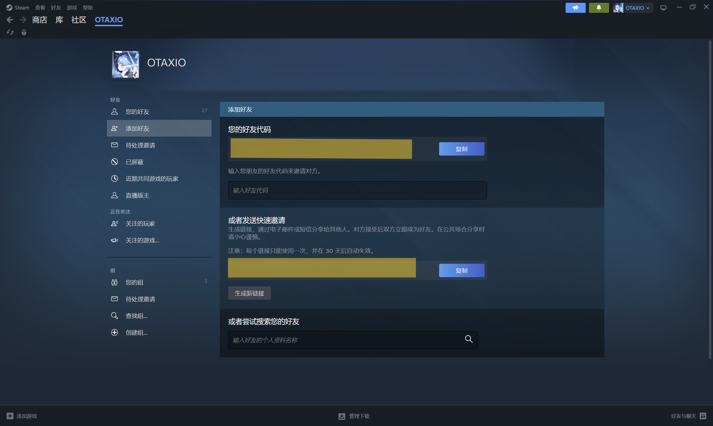

---

### 五小功能
左上角还有五个小字号的功能：

分别是：**Steam、查看、好友、游戏、帮助**。  

例如：
- **Steam**：更换账号、退出、离线模式、检查更新、还原备份、设置等。

---

目前更新到此，之后准备完善Steam左上角功能介绍，右上角功能介绍，底部功能介绍。之后再讲解Steam设置相关问题。然后介绍游戏购买途径，最后给出大家遇到的问题。一个人力量太小了，并且有很多不清楚的事情，而且会出现错误。期望大家多多提出意见，最好能给出正确答案（就算是错的也没关系，大家一起修正就好了）
## 结束语
希望这份指南对大家有所帮助！
